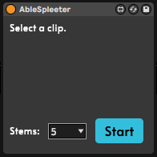

# Spleeter for Max

- Originally done by [diracdeltas](https://github.com/diracdeltas/spleeter4max), years ago, this is the updated and the better version with more features.
<div style="margin: auto, width: 50%;"></div>

Ableton max device for separating a clip into stems (vocals, bass, drums,
other) **using an existing installation of spleeter**. if you aren't able to
install spleeter, check out

All instructions were tested with Max 8.5 / Ableton 11.1.5.

### Windows steps:

1. Install ffmpeg following the instructions in https://github.com/adaptlearning/adapt_authoring/wiki/Installing-FFmpeg#installing-ffmpeg-in-windows.

> :white_check_mark: to test, run `ffmpeg` in CMD.exe, if there is no output something is wrong

2. Install **python 3.10 (3.7 also works fine)** from https://www.python.org/downloads/release/python-377/. in the installer, make sure to enable the setting that adds Python to your path and disable the "path length variable limit" option when you get to the end of the install process.

> :white_check_mark: to test, run `python -V` or `py -V` in CMD.exe, if there is no output or something other than `Python 3.7.X` then something is wrong

3. Open windows environment variable editor and remove `.JS;` from PATHEXT (https://support.shotgunsoftware.com/hc/en-us/articles/114094235653-Setting-global-environment-variables-on-Windows). on some systems you may need to restart for these changes to take effect.

> :white_check_mark: to test, run `echo %pathext%` in CMD.exe and make sure `.JS` is not there

4. Open CMD.exe and type `pip3 install spleeter` (hit enter)

> :white_check_mark: to test, run `spleeter -h` in CMD.exe. it should show you usage instructions. if not, you may need to [set spleeter to run as administrator](https://github.com/diracdeltas/spleeter4max/issues/7) or try [the instructions in this thread](https://github.com/diracdeltas/spleeter4max/issues/8).

### macOS steps:

1. Install homebrew: https://brew.sh/

2. Open terminal and install python3.10/ffmpeg/spleeter with the following commands:
```
brew install python@3.10
brew link --force python@3.10
brew install ffmpeg
pip3 install spleeter
```
Note: If you already have Python 3.10+ installed from Homebrew, you may need to run `brew unlink python3` first.

3. On some versions of macOS, spleeter gets installed somewhere other than `/usr/local/bin/spleeter`. you can check this by typing `which spleeter` into the terminal. if this is the case, enter this into the terminal to fix the location:
```
ln -s $(which spleeter) /usr/local/bin/spleeter
```

## Running

1. Clone this repo.
2. Put `AbleSpleeter.amxd` onto any audio channel.
3. Select any audio clip in Ableton by clicking on it.
4. Press the start button in the spleeter device and wait.


## License (MIT)

Copyright 2022 Alexshcer

Permission is hereby granted, free of charge, to any person obtaining a copy of
this software and associated documentation files (the "Software"), to deal in
the Software without restriction, including without limitation the rights to
use, copy, modify, merge, publish, distribute, sublicense, and/or sell copies
of the Software, and to permit persons to whom the Software is furnished to do
so, subject to the following conditions:

The above copyright notice and this permission notice shall be included in all
copies or substantial portions of the Software.

THE SOFTWARE IS PROVIDED "AS IS", WITHOUT WARRANTY OF ANY KIND, EXPRESS OR
IMPLIED, INCLUDING BUT NOT LIMITED TO THE WARRANTIES OF MERCHANTABILITY,
FITNESS FOR A PARTICULAR PURPOSE AND NONINFRINGEMENT. IN NO EVENT SHALL THE
AUTHORS OR COPYRIGHT HOLDERS BE LIABLE FOR ANY CLAIM, DAMAGES OR OTHER
LIABILITY, WHETHER IN AN ACTION OF CONTRACT, TORT OR OTHERWISE, ARISING FROM,
OUT OF OR IN CONNECTION WITH THE SOFTWARE OR THE USE OR OTHER DEALINGS IN THE
SOFTWARE.

## Credits

https://github.com/deezer/spleeter
